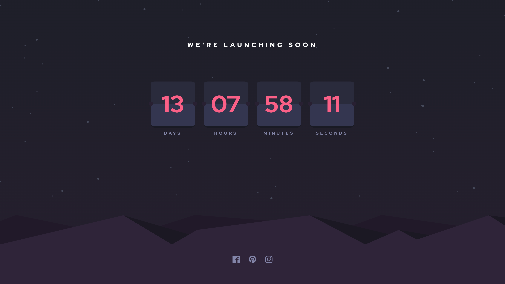
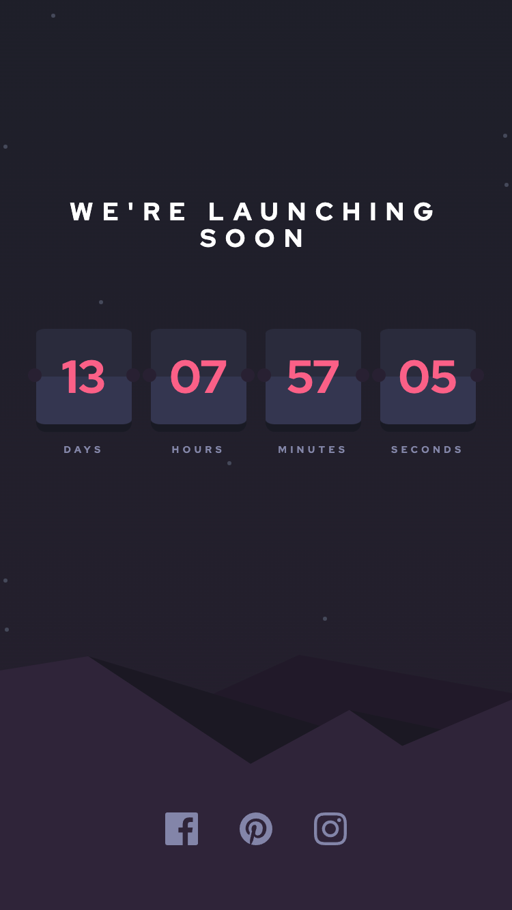

# Frontend Mentor - Order summary card solution

This is a solution to the [Launch countdown timer challenge on Frontend Mentor](https://www.frontendmentor.io/challenges/launch-countdown-timer-N0XkGfyz-). Frontend Mentor challenges help you improve your coding skills by building realistic projects.

## Table of contents

- [Overview](#overview)
  - [The challenge](#the-challenge)
  - [Screenshot](#screenshot)
  - [Links](#links)
- [My process](#my-process)
  - [Built with](#built-with)
  - [What I learned](#what-i-learned)
  - [Continued development](#continued-development)
  - [Useful resources](#useful-resources)
- [Author](#author)
- [Acknowledgments](#acknowledgments)

**Note: Delete this note and update the table of contents based on what sections you keep.**

## Overview

### The challenge

Users should be able to:

- See hover states for all interactive elements on the page
- See a live countdown timer that ticks down every second (start the count at 14 days)
- **Bonus**: When a number changes, make the card flip from the middle

### Screenshot

Screenshot desktop

Screenshot mobile

### Links

- [Solution URL](https://your-solution-url.com)
- [Live Site URL](https://your-live-site-url.com)

## My process

### Built with

- Semantic HTML5 markup
- CSS custom properties
- Flexbox
- Mobile-first workflow
- [Vue](https://vuejs.org/) - JS library
- Accesibility

### What I learned

- Vite
- Vue 3
- Composition API
- CSS animations

### Useful resources

- [Building a Vue3 Typescript Environment with Vite](https://miyauchi.dev/posts/vite-vue3-typescript/) - This helped me for configurate the base vite structure, using prettier, stylelin and eslint. I really liked this approach because generate a base boilerplate with all the best practices.
- [Vite features](https://vitejs.dev/guide/features.html) - This is an amazing docs which helped me finally understand how configurate the vite pluggins. I'd recommend it to anyone still learning this Vite.

**Note: Delete this note and replace the list above with resources that helped you during the challenge. These could come in handy for anyone viewing your solution or for yourself when you look back on this project in the future.**

## Author

- Website - [Nicolas Montoya](https://www.nicolasmontoya.com)
- Frontend Mentor - [@NicolasMontoya](https://www.frontendmentor.io/profile/nicolasmontoya)
